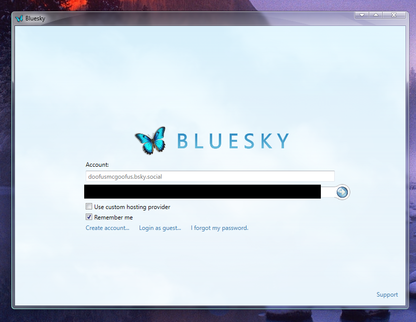
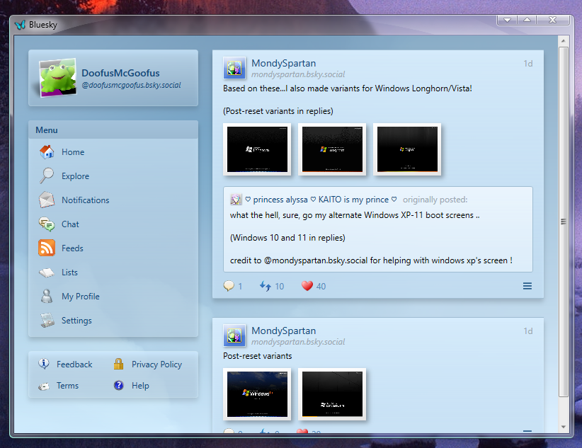
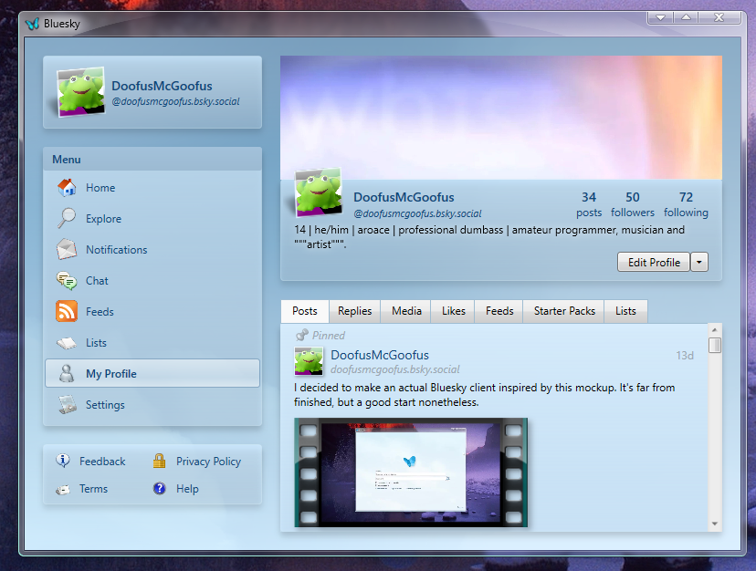
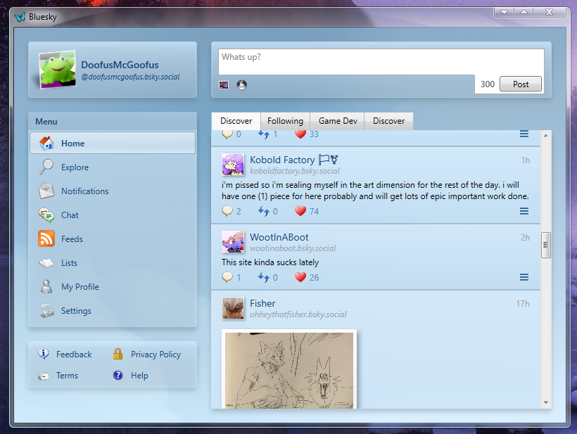

# Longhorn Bluesky
A third-party Bluesky client with a Windows Longhorn theme.  
    
    
    
    

## How to install
1. Download the zip file in the releases
2. Extract the zip file
3. Run Client.exe (or "Longhorn Bluesky" if you can't find it) from the extracted folder

## Upcoming Features (in no specific order)
- Video playback
- Alt text support
- Proper high-DPI support (no bugs, just low quality icons)
- 2FA support
- Profile editing
- Changable settings
- Explore, Notifications, Chat, Feeds, and Lists
- Viewable post engagments
- Account creation and deletion
- Tenor GIF support
- Viewing as a guest
- Finishing Help and Support
- Client themes
- Profile themes?
- ...and the remaining Bluesky features

## Compatibility
✔ Windows 11 / Server 2025  
✔ Windows 10 / Server (2016/2019/2022)  
✔ Windows 8.x / Server 2012  
🟡 Windows 7 (Client launches, but doesn't log in.)  
🟡 Windows Server 2008 R2 (Untested, but I assume it doesn't work) (Client launches, but doesn't log in.)  
🟡* Windows Vista / Windows Server 2008 and before (With SP2) (.NET 4.7.2 is not normally support on Windows Vista, but I believe there might be a way to install it.) (Client launches, but doesn't log in.)  
❓ Windows Betas / Insider Builds (They might work, but compatibilty isn't guaranteed)  
❌ Windows Longhorn (Pre-Reset) (Sorry)  
❌ Windows XP or earlier  

## Credits
- DoofusMcGoofus - Programming, Design  
- MondySpartan - Original Concept  
- Samsung - Sound Design (Longhorn Sound Scheme)  
