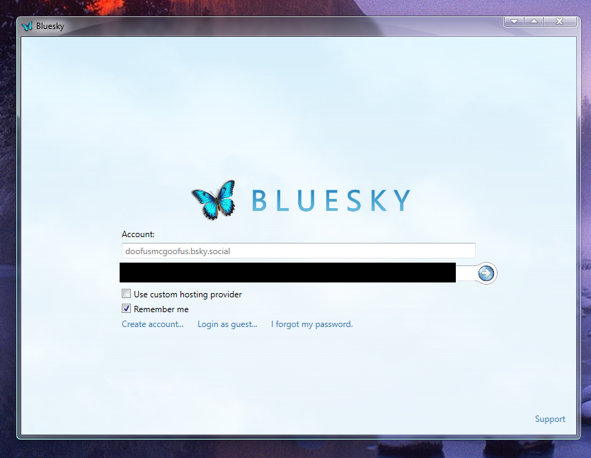
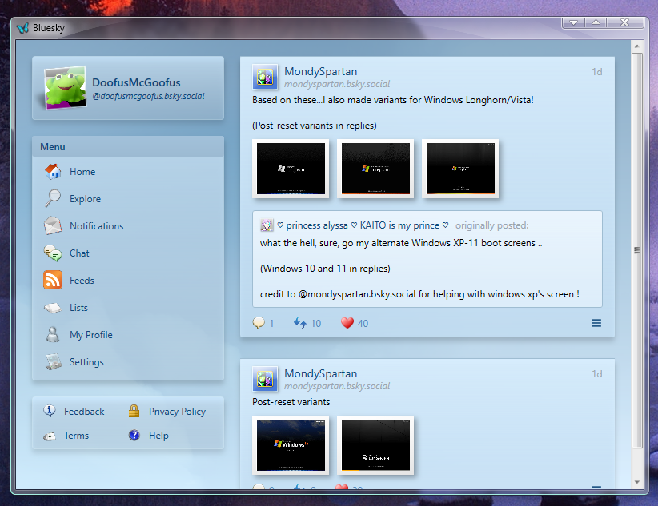
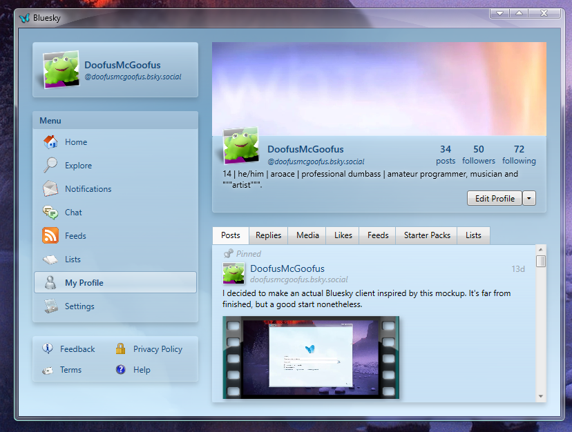
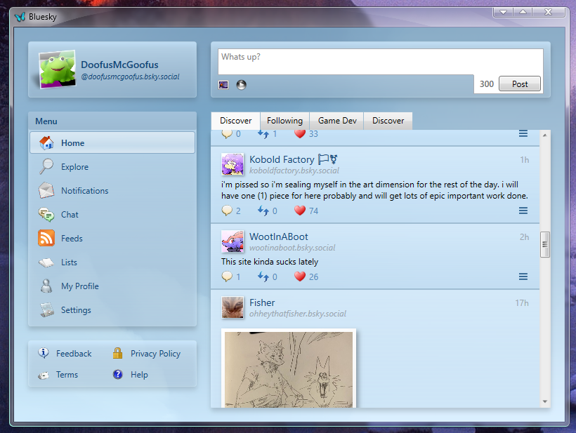

  

    
🌐 Language

    

      

        <a href="https://openaitx.github.io/view.html?user=Doofus-Mc-Goofus&project=LonghornBluesky&lang=en">English</a>
        | <a href="https://openaitx.github.io/view.html?user=Doofus-Mc-Goofus&project=LonghornBluesky&lang=zh-CN">简体中文</a>
        | <a href="https://openaitx.github.io/view.html?user=Doofus-Mc-Goofus&project=LonghornBluesky&lang=zh-TW">繁體中文</a>
        | <a href="https://openaitx.github.io/view.html?user=Doofus-Mc-Goofus&project=LonghornBluesky&lang=ja">日本語</a>
        | <a href="https://openaitx.github.io/view.html?user=Doofus-Mc-Goofus&project=LonghornBluesky&lang=ko">한국어</a>
        | <a href="https://openaitx.github.io/view.html?user=Doofus-Mc-Goofus&project=LonghornBluesky&lang=hi">हिन्दी</a>
        | <a href="https://openaitx.github.io/view.html?user=Doofus-Mc-Goofus&project=LonghornBluesky&lang=th">ไทย</a>
        | <a href="https://openaitx.github.io/view.html?user=Doofus-Mc-Goofus&project=LonghornBluesky&lang=fr">Français</a>
        | <a href="https://openaitx.github.io/view.html?user=Doofus-Mc-Goofus&project=LonghornBluesky&lang=de">Deutsch</a>
        | <a href="https://openaitx.github.io/view.html?user=Doofus-Mc-Goofus&project=LonghornBluesky&lang=es">Español</a>
        | <a href="https://openaitx.github.io/view.html?user=Doofus-Mc-Goofus&project=LonghornBluesky&lang=it">Italiano</a>
        | <a href="https://openaitx.github.io/view.html?user=Doofus-Mc-Goofus&project=LonghornBluesky&lang=ru">Русский</a>
        | <a href="https://openaitx.github.io/view.html?user=Doofus-Mc-Goofus&project=LonghornBluesky&lang=pt">Português</a>
        | <a href="https://openaitx.github.io/view.html?user=Doofus-Mc-Goofus&project=LonghornBluesky&lang=nl">Nederlands</a>
        | <a href="https://openaitx.github.io/view.html?user=Doofus-Mc-Goofus&project=LonghornBluesky&lang=pl">Polski</a>
        | <a href="https://openaitx.github.io/view.html?user=Doofus-Mc-Goofus&project=LonghornBluesky&lang=ar">العربية</a>
        | <a href="https://openaitx.github.io/view.html?user=Doofus-Mc-Goofus&project=LonghornBluesky&lang=fa">فارسی</a>
        | <a href="https://openaitx.github.io/view.html?user=Doofus-Mc-Goofus&project=LonghornBluesky&lang=tr">Türkçe</a>
        | <a href="https://openaitx.github.io/view.html?user=Doofus-Mc-Goofus&project=LonghornBluesky&lang=vi">Tiếng Việt</a>
        | <a href="https://openaitx.github.io/view.html?user=Doofus-Mc-Goofus&project=LonghornBluesky&lang=id">Bahasa Indonesia</a>
        | <a href="https://openaitx.github.io/view.html?user=Doofus-Mc-Goofus&project=LonghornBluesky&lang=as">অসমীয়া</
      

    

  

# Longhorn Bluesky
A third-party Bluesky client with a Windows Longhorn theme.  
    
    
    
    

## Upcoming Features (in no specific order)
- Video playback
- Proper high-DPI support (no bugs, just low quality icons)
- 2FA support
- Attaching alt text
- Profile editing
- Changable settings
- Notifications, Chat, Feeds, and Lists
- Finish Explore
- Reporting posts and users
- Account creation and deletion
- Tenor GIF support
- Viewing as a guest
- Finishing Help and Support
- Client themes
- Profile themes?
- ...and the remaining Bluesky features

## Compatibility
✔ Windows 11 / Server 2025  
✔ Windows 10 / Server (2016/2019/2022)  
✔ Windows 8.x / Server 2012  
✔ Windows 7 / Server 2008 R2  
🟡* Windows Vista / Windows Server 2008 (With SP2) (Untested) (.NET 4.7.2 isn't normally support on Windows Vista, but I believe there might be a way to install it.)  
❓ Windows Betas / Insider Builds (They might work, but compatibilty isn't guaranteed)  
❌ Windows Longhorn (Pre-Reset) (Sorry)  
❌ Windows XP or earlier  

## Credits
- DoofusMcGoofus - Programming, Design  
- MondySpartan - Original Concept  
- Samsung - Sound Design (Longhorn Sound Scheme)  
